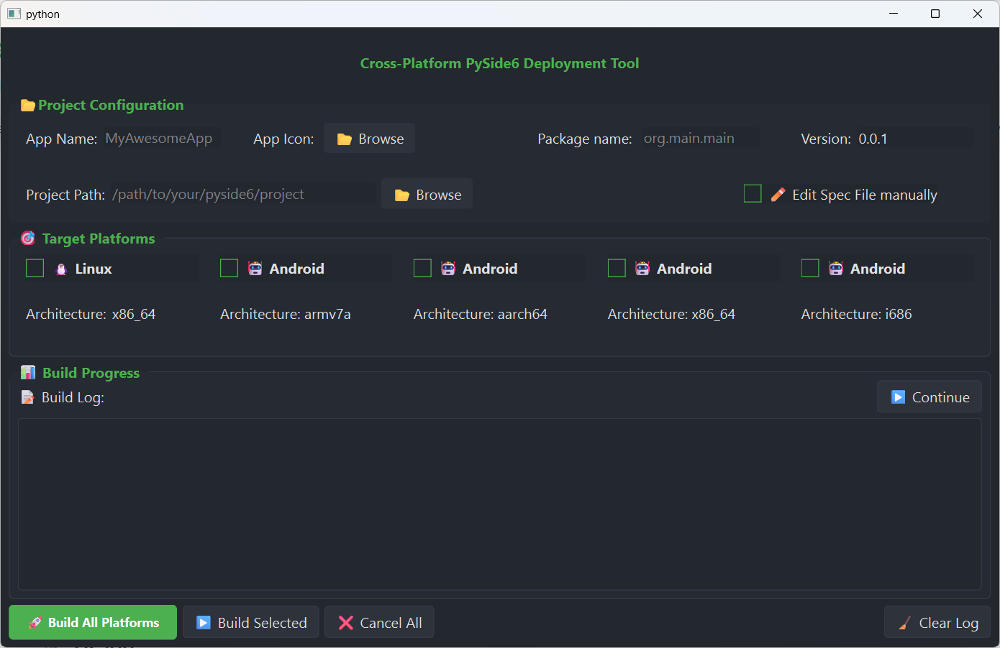

# Cross-Platform PySide6 Deployment Tool

A modern, interactive GUI tool to build and package your PySide6 applications for both Linux and Android, with support for custom icons, project configuration, and real-time build logs.
Effortlessly build and package your PySide6 applications for Linux and Android with a single click! No more command-line struggles—just a beautiful, interactive GUI that guides you from project setup to APK and executable creation. Deploy, customize, and monitor your builds in real time, all in one place.

---

## 🚀 Features

- **Build for Linux and Android (armv7a, aarch64, x86_64, i686)**
- **Custom app icon and project metadata**
- **Edit spec file before build (pause/resume)**
- **Real-time build log and progress**
- **One-click build/cancel/clear log**
- **Beautiful dark-themed UI with emoji indicators**

---

## 🖥️ Requirements

- Python 3.10+
- [PySide6](https://pypi.org/project/PySide6/)
- [PyInstaller](https://pypi.org/project/pyinstaller/)
- [GitPython](https://pypi.org/project/GitPython/)
- 7z (for Android NDK extraction)
- Linux OS (for building Android APKs)

Install dependencies:
```bash
pip install PySide6 PyInstaller GitPython
sudo apt install p7zip-full
```

---

## 📦 Project Structure

```
.
├── main.py                # Main GUI application
├── main.ui                # Qt Designer UI file
├── ui_main.py             # Generated Python UI code
├── build_Linux.py         # Linux build logic
├── build_Android.py       # Android build logic
├── spec_editor.txt        # Script for editing spec files and pausing
└── ReadMe.md
```

---

## 🏁 Getting Started

1. **Clone or download this repository.**
2. **Open a terminal in the project directory.**
3. **Run the GUI:**
   ```bash
   python main.py
   ```

### Or just install it from pip
1. ```bash
    pip install PySide6-to-apk
    ```
2. **Open a terminal.**
3. **Run the GUI:**
    ```bash
    PySide6-to-apk
    ```
---
### The GUI

---

## 🛠️ Usage

### 1. Configure Your Project

- **App Name:** Enter your application's name.
- **App Icon:** Click 📂 Browse to select an image file for your app icon.
- **Package Name:** (Android) Enter your package name (e.g., `org.example.myapp`).
- **Version:** Set your app version.
- **Project Path:** Select your PySide6 project directory.

### 2. Select Target Platforms

- Check the platforms you want to build for (🐧 Linux, 🤖 Android architectures).

### 3. (Optional) Edit Spec File

- Check "✏️ Edit Spec File manually" if you want to pause the build and edit the generated spec file before continuing.

### 4. Build

- Click **🚀 Build All Platforms** to build for all targets.
- Or click **▶️ Build Selected** to build only the checked platforms.

### 5. Monitor Progress

- View real-time logs in the build log area.
- As each build completes, a ✅ will appear next to the platform.

### 6. Pause/Resume for Spec Editing

- If you checked "Edit Spec File manually", the build will pause after generating the spec file.
- Edit the spec file in your project directory.
- Click **▶️ Continue** to resume the build.

### 7. Cancel or Clear

- Click **❌ Cancel All** to stop all running builds.
- Click **🧹 Clear Log** to clear the build log area.

---

## 📂 Output

- Linux executables and Android APKs are placed in a `dist/` folder inside your project directory.

---

## 📝 Notes

- The tool uses PyInstaller for Linux and `pyside6-android-deploy` for Android.
- For Android, the first build will download and set up the NDK, SDK, and wheels automatically.
- If you encounter permission issues, run the tool with appropriate permissions or adjust your project directory.

---

## 💡 Troubleshooting

- **No spec file to edit?**  
  You must start a build with "Edit Spec File manually" checked for the pause/edit/resume workflow to work.
- **Build fails or hangs?**  
  Check the build log for errors. Ensure all dependencies are installed and your environment is set up for Android builds.

---

## 🤝 Contributing

Pull requests and suggestions are welcome! Please open an issue for bugs or feature requests.

---

## 📜 License

MIT License (https://opensource.org/license/mit)

---

## 🙏 Acknowledgements

- [Qt for Python (PySide6)](https://doc.qt.io/qtforpython/)
- [PyInstaller](https://www.pyinstaller.org/)
- [GitPython](https://gitpython.readthedocs.io/)
